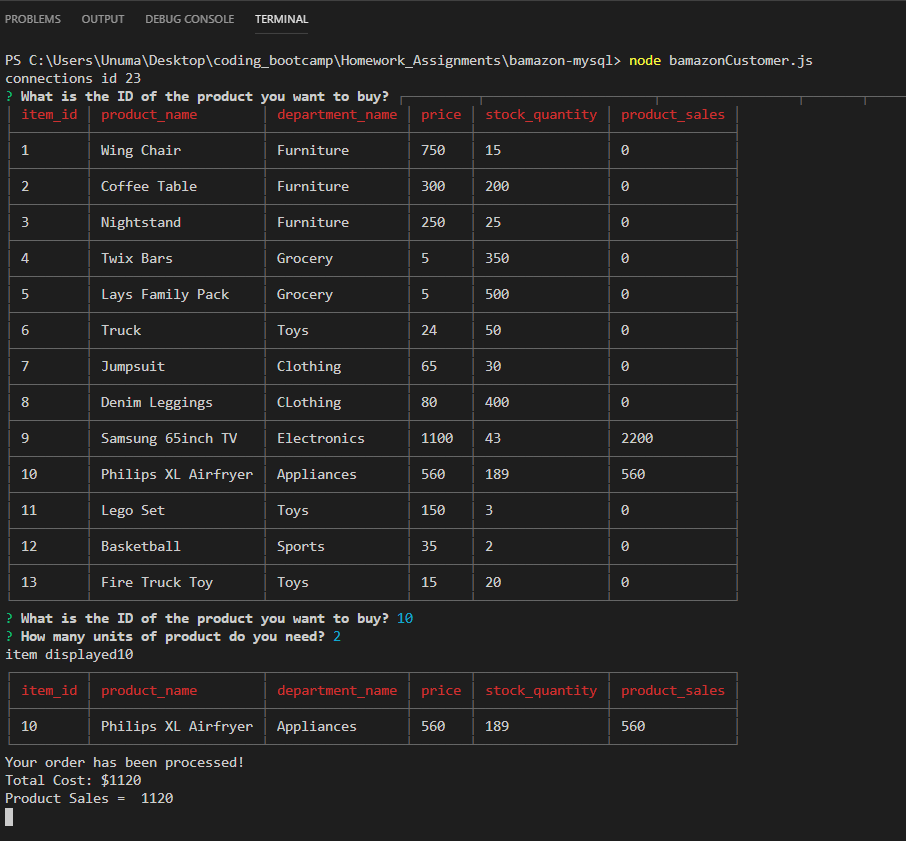
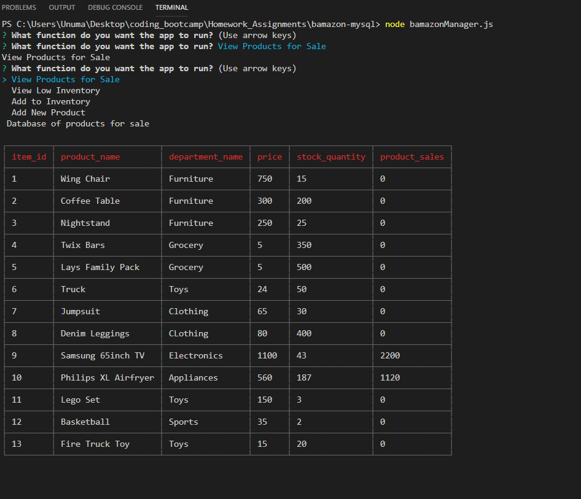

[](https://github.com/anumasif1/bamazon-mysql)
[](https://github.com/anumasif1/bamazon-mysql/fork)

# bamazon-mysql
Bamazon is a shopping app based on Amazon concept. It will take in orders from customers and deplete stock from the store's inventory using MySQL, Node.js and Inquirer.


**Node Packages used for this program:**
* Inquirer
* CLI-Table
* MySql

This app consists of three files for following users:
* Customer
* Manager
* Supervisor

Database is created and updated in MySql file bamazon.sql which is then connected to all three js files. 

```ruby
DROP DATABASE IF EXISTS bamazon_DB;
CREATE DATABASE bamazon_DB;
USE bamazon_DB;
CREATE table products(
item_id INT NOT NULL auto_increment,
product_name varchar(50) NOT NULL,
department_name varchar(50) NOT NULL,
price INT not null,
stock_quantity int not null,
PRIMARY KEY (item_id)
);
```

```ruby
CREATE table departments(
departments_id INT NOT NULL auto_increment,
department_name varchar(50) NOT NULL,
over_head_costs INT not null,
primary key (departments_id)
);

select * from departments;
```
It is then connected to all js files using standard method.

```ruby

/create the connection information for the sql database/
var connection = mysql.createConnection({
    host: "localhost",
    /port, username, password and database name./
    port: 3306,
    user: "root",
    password: "root",
    database: "bamazon_DB"
});

connection.connect(function (err) {
    if (err) throw err;
    console.log("connections id" + " " + connection.threadId);
});
```

**--------------------------------------------------------------------------------**

##Bamazon Customer




BamazonCustomer.js first displays the products database in terminal and then prompt inquirer to check what product would customer like to buy and how many units.

**Function SelectAll();**
Function selectAll select entire data from table "product" in bamazon.sql file.

```ruby

function selectAll() {
   
    connection.query("SELECT * FROM products", function (err, res) {
        if (err) throw err;
        console.log(res);
    });
}
```

**Function askCustomer();**
inquirer to check which product does customer require

```ruby
function askCustomer() {

    inquirer
        .prompt([
            {
                type: "input",
                name: "productID",
                message: "What is the ID of the product you want to buy?"
            },
            {
                type: "input",
                name: "units",
                message: "How many units of product do you need?"
            }
        ])

        .then(function (customer) {
            customerPick = customer.productID;
            quantityRequired = customer.units;

        })
}
```
Once user selects the product and id the code then check for the item in sql database. It will process the order if the item is in stock, update the inventory in database and run message "Your order has been processed". In case product is out of strock, it will run message "Insufficient Quantity!".

```ruby

function readProductID(customer) {
    connection.query(
        "SELECT * FROM PRODUCTS WHERE ?",
        {
            item_id: customerPick
        },

        function (err, res) {
            if (err) throw err;
            console.log("item displayed" + customerPick);
            console.log(res);
        }
    );

    /call checkAvailability() to check if required item is in stock and to update it's count if it is./
    checkAvailability();
}
```

```ruby

function checkAvailability(customer) {
    /console.log("Checking if item is in stock.")/
    connection.query(
        "SELECT * FROM products WHERE ?",
        {
            item_id: customerPick
        },
        function (err, res) {
            if (err) throw err;

            /checking if the item is in stock and updating inventory/
            if (quantityRequired <= res[0].stock_quantity) {
                console.log("Your order has been processed!");
                totalCost = res[0].price * quantityRequired;
                console.log("Total Cost:" + " " + "$" + totalCost);

                
                stockRemaining = res[0].stock_quantity - quantityRequired;

                connection.query(

                  
                    "UPDATE products SET ? WHERE ?",
                    [
                        {
                            stock_quantity: stockRemaining
                        },
                        {
                            item_id: customerPick
                        }
                    ],
                    function (err, res) {
                        if (err) throw err;
                    }
                );
            } else {
                console.log("Insufficient Quantity!")
            }
        }

    );
    productSales();
}
```
Once the order is processed the code then calculates and display the total cost of the purchase. It is then updated in products database altered column "product_Sales"

```ruby

function productSales(customer) {
    connection.query(
        "SELECT * FROM products WHERE ?",
        {
            item_id: customerPick
        },
        function (err, res) {
            if (err) throw err;

            if (totalCost > 0) {
                console.log("Product Sales = " + " " + totalCost);
                connection.query(

                    "UPDATE products SET ? WHERE ?",
                    [
                        {
                            product_sales: totalCost
                        },
                        {
                            item_id: customerPick
                        }
                    ],
                    function (err, res) {
                        if (err) throw err;
                    }
                );
            } else {
                console.log("0 sales")
            }
        }

    );
 }
 ```

**---------------------------------------------------------------------------------------------------------------**

##Bamazon Manager

This file prompts inquirer to check from manager what function he would like to run.

**Inquirer**
```Ruby
function start() {
    inquirer
        .prompt([
            {
                type: "list",
                name: "managerOptions",
                message: "What function do you want the app to run?",
                choices: ["View Products for Sale", "View Low Inventory", "Add to Inventory", "Add New Product"]
            }
        ]).then(function (manager) {
            managerFunction = manager.managerOptions;
            console.log(managerFunction);

            if (managerFunction === "View Products for Sale") {
                viewProducts();
            }
            else if (managerFunction === "View Low Inventory") {
                lowInventory();
            }
            else if (managerFunction === "Add to Inventory") {
                addInventory();
            }
            else if (managerFunction === "Add New Product") {
                addProduct();
            }
        });
}
```

**bamazonManager.js in terminal:**

viewProducts(); display entire database "products"
```ruby
function viewProducts(manager) {
    /select and display entire data from table "product" in bamazon.sql file./
    connection.query("SELECT * FROM products",
        function (err, res) {
            if (err) throw err;
            console.log("\n Database of products for sale \n");
            var table = new Table({
                head: ['item_id', "product_name", "department_name", 'price', 'stock_quantity', 'product_sales']
            });
            for (var i = 0; i < res.length; i++) {
                table.push([res[i].item_id, res[i].product_name, res[i].department_name, res[i].price, res[i].stock_quantity, res[i].product_sales]);
            }
            console.log(table.toString());
        });
}

```


lowInventory(); display all products with stock less than or equal to 5

```ruby
function lowInventory() {
    /displaying products less than 5 in quantity/
    connection.query('SELECT * FROM products WHERE stock_quantity < 5',
        function (err, res) {
            if (err) throw err;
            console.log('\n  All products with quantity lower than 5 \n');
            var table = new Table({
                head: ['item_id', "product_name", "department_name", 'price', 'stock_quantity', 'product_sales']
            });
            for (var i = 0; i < res.length; i++) {
                table.push([res[i].item_id, res[i].product_name, res[i].department_name, res[i].price, res[i].stock_quantity, res[i].product_sales]);
            }
            console.log(table.toString());
        })
}
```


addInventory(); updates the inventory of specified product

```ruby

function addInventory() {
    /inquirer to confirm product ID and quantity to be updates/
    inquirer
        .prompt([
            {
                type: "input",
                name: "productID",
                message: "Please enter ID of the product to change it's inventory!"
            },
            {
                type: "input",
                name: "quantity",
                message: "How much quantity do you have?"
            }
        ])
        .then(function (answer) {
            /update the quantity on database/
            connection.query(
                "UPDATE products SET ? WHERE ?",
                [
                    {
                        stock_quantity: answer.quantity
                    },
                    {
                        item_id: answer.productID
                    }
                ],
                function (err) {
                    if (err) throw err;
                    console.log("\n Inventory has been updated! \n");
                }
            )
        })
}
```


addProduct(); allows user to add new product in the database

```ruby
function addProduct() {
    /inquirer on the new product and information required for the database/
    inquirer
        .prompt([
            {
                name: "item",
                type: "input",
                message: "What is the product you would like to sell?"
            },
            {
                name: "department",
                type: "input",
                message: "Which department would you like to place your product in?"
            },
            {
                name: "price",
                type: "input",
                message: "What is the price of the product?"
            },
            {
                name: "quantity",
                type: "input",
                message: "How much quantity of the product do you have in stock?"
            }
        ])
        .then(function (answer) {
            connection.query(
                /insert new product in database products/
                "INSERT INTO products SET?",
                {
                    product_name: answer.item,
                    department_name: answer.department,
                    price: answer.price,
                    stock_quantity: answer.quantity
                },
                function (err) {
                    if (err) throw err;
                    console.log("Your product has been added");
                    /Calling start function again for next action /
                    start();
                }
            );
        });
}
```


**------------------------------------------------------------------------------------------------------------------------**

##Bamazon Supervisor

bamazonSupervisor.js performs following 3 functions
* Inquire what function would suoervisor like to run?
* View Product sales by department
* Add a Department

**Inquirer**
```ruby
function start() {
    inquirer
        .prompt([
            {
                type: "list",
                name: "supervisorOptions",
                message: "What function do you want the app to run?",
                choices: ["View Product Sales by Department", "Create New Department"]
            }
        ]).then(function (supervisor) {
            supervisorFunction = supervisor.supervisorOptions;
            console.log(supervisorFunction);
            var query;
            if (supervisorFunction === "View Product Sales by Department") {
                viewProducts(); 
            } else if (supervisorFunction === "Create New Department"){
                addDepartment();
            }

        });
}
```

***View Product Sales by Department**
```ruby

function viewProducts() {
    query = "SELECT departments.departments_id, departments.department_name, departments.over_head_costs, products.product_sales, (products.product_sales-departments.over_head_costs) as total_profit";
    query += " FROM departments INNER JOIN products ON (departments.department_name = products.department_name)";


    /console.log(query);/
    connection.query(query,
        function (err, res) {
            var table = new Table({
                head: ['departments_id', "department_name", "over_head_costs", 'product_sales', 'total_profit']
            });
            /console.log(res.length);/
            for (var i = 0; i < res.length; i++) {
                table.push([res[i].departments_id, res[i].department_name, res[i].over_head_costs, res[i].product_sales, res[i].total_profit]);
            }
            /*res.foreach(function(data){
                table.push({'Department ID':data.departments_id});
            });*/
            console.log(table.toString());
        });
        start();
}
```

viewProducts(); in terminal


**Add Department**

addDepartment();
```ruby

function addDepartment() {
    //inquirer on the new product and information required for the database
    inquirer
        .prompt([
            {
                name: "department_name",
                type: "input",
                message: "Which department would you like to add?"
            },
            {
                name: "over_head_costs",
                type: "input",
                message: "What is the over head cost?"
            }
        ])
        .then(function (answer) {
            connection.query(
                //insert new product in database products
                "INSERT INTO departments SET?",
                {
                    department_name: answer.department_name,
                    over_head_costs: answer.over_head_costs,
                },
                function (err) {
                    if (err) throw err;
                    console.log("Your department has been added");
                    //Calling start function again for next action 
                    start();
                }
            );
        });
}

```


